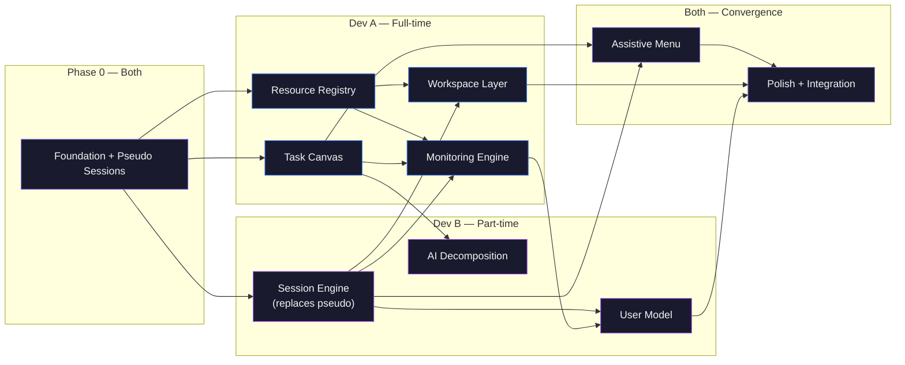

# Buddy MVP — Implementation Plan (v3)

> **Buddy gives you a space to work rather than accounting your work.**

A desktop productivity manager built with **Tauri v2 + Vite + React + Rust + SQLite**. Offline-first, single-user, single-device. Windows primary, Linux secondary.

---

## Development Model

| | Dev A | Dev B |
|---|---|---|
| **Availability** | Full-time, always available | Part-time, works when available |
| **Owns** | Interactive surface layer | Intelligence / brain layer |
| **Modules** | Task Canvas, Resource Registry, Monitoring, Workspace | Session Engine, AI Decomposition, User Model |
| **Shared** | Phase 0, Assistive Menu, Polish | Phase 0, Assistive Menu, Polish |

### How It Works

- **Phase 0** is done together — includes a **pseudo session system** (basic start/stop) so Dev A can test monitoring without waiting for Dev B's real Session Engine.
- After Phase 0, **both devs work independently, at their own pace, on separate modules**. No blocking, no waiting.
- Interface contracts + stubs from Phase 0 keep everything compatible.
- When Dev B completes the real Session Engine, it **replaces** the pseudo session seamlessly (same IPC signatures).
- **Convergence** happens for Assistive Menu and final Polish.

### Module Dependency Map



**Legend**: 🔵 Dev A &nbsp; 🟣 Dev B &nbsp; 🟣🔵 Both

---

## Tech Stack

| Layer | Choice | Rationale |
|-------|--------|-----------|
| Desktop framework | Tauri v2 | Rust backend, webview frontend, small binary |
| Frontend bundler | Vite | Fast HMR, native ESM, React plugin |
| Frontend framework | React 18+ | Component model, ecosystem, ReactFlow compat |
| Canvas library | ReactFlow | Pan/zoom/nodes/edges OOTB, pure SVG (Linux safe) |
| Backend language | Rust | Tauri native, system API access, SQLite bindings |
| Database | SQLite (rusqlite) | Embedded, zero-config, offline-first |
| Styling | Vanilla CSS + custom properties | Full control, HSL design tokens |
| Typography | Inter (sans) + Geist Mono (mono) | Premium legibility |

---

## Design System

### Color System (HSL Dark Theme)

```css
:root {
  /* Surfaces */
  --bg-base: hsl(240, 10%, 5%);
  --bg-surface: hsl(240, 6%, 9%);
  --bg-elevated: hsl(240, 5%, 13%);
  --bg-overlay: hsl(240, 4%, 16%);

  /* Accent (blue-violet) */
  --accent: hsl(245, 82%, 67%);
  --accent-hover: hsl(245, 82%, 72%);
  --accent-subtle: hsl(245, 82%, 67%, 0.12);

  /* Text */
  --text-primary: hsl(0, 0%, 95%);
  --text-secondary: hsl(0, 0%, 65%);
  --text-muted: hsl(0, 0%, 45%);

  /* Status */
  --success: hsl(142, 71%, 45%);
  --warning: hsl(38, 92%, 50%);
  --danger: hsl(0, 84%, 60%);
  --info: hsl(199, 89%, 48%);

  /* Borders & Shadows */
  --border-subtle: hsl(240, 6%, 18%);
  --border-focus: var(--accent);
  --shadow-sm: 0 1px 2px hsl(0, 0%, 0%, 0.3);
  --shadow-md: 0 4px 12px hsl(0, 0%, 0%, 0.4);
  --shadow-lg: 0 8px 24px hsl(0, 0%, 0%, 0.5);

  /* Radii */
  --radius-sm: 6px;
  --radius-md: 10px;
  --radius-lg: 16px;
  --radius-full: 9999px;

  /* Transitions */
  --ease-spring: cubic-bezier(0.34, 1.56, 0.64, 1);
  --ease-smooth: cubic-bezier(0.4, 0, 0.2, 1);
  --duration-fast: 150ms;
  --duration-normal: 250ms;
  --duration-slow: 400ms;
}
```

### Animation Guidelines

- **Spring-based transitions** via `var(--ease-spring)` for premium feel
- **Smooth opacity fades** for view/workspace switching
- **Subtle scale + translate on hover** for interactive elements
- **60fps target** — `transform` and `opacity` only, no layout thrashing
- Prefer CSS transitions; use `framer-motion` only for complex orchestrated sequences

### Typography

```css
@import url('https://fonts.googleapis.com/css2?family=Inter:wght@100..900&display=swap');

body {
  font-family: 'Inter', -apple-system, BlinkMacSystemFont, sans-serif;
  font-size: 14px;
  line-height: 1.5;
  -webkit-font-smoothing: antialiased;
}

code, pre, .mono {
  font-family: 'Geist Mono', 'JetBrains Mono', 'Fira Code', monospace;
}
```

---

## Project Structure

```
buddy/
├── src-tauri/
│   ├── src/
│   │   ├── main.rs
│   │   ├── lib.rs
│   │   ├── db/
│   │   │   ├── mod.rs
│   │   │   ├── schema.rs              # All CREATE TABLE statements
│   │   │   └── connection.rs          # SQLite pool setup
│   │   ├── models/
│   │   │   ├── mod.rs
│   │   │   ├── task.rs
│   │   │   ├── session.rs
│   │   │   ├── resource.rs
│   │   │   ├── monitoring.rs
│   │   │   ├── violation.rs
│   │   │   ├── boss_key.rs
│   │   │   ├── user_model.rs
│   │   │   └── settings.rs
│   │   ├── commands/
│   │   │   ├── mod.rs
│   │   │   ├── task_commands.rs       # Dev A
│   │   │   ├── session_commands.rs    # Phase 0 (pseudo) → Dev B (real)
│   │   │   ├── resource_commands.rs   # Dev A
│   │   │   ├── monitoring_commands.rs # Dev A
│   │   │   ├── workspace_commands.rs  # Dev A
│   │   │   ├── user_model_commands.rs # Dev B
│   │   │   └── ai_commands.rs         # Dev B
│   │   └── services/
│   │       ├── mod.rs
│   │       ├── task_service.rs        # Dev A
│   │       ├── session_service.rs     # Phase 0 (pseudo) → Dev B (real)
│   │       ├── resource_service.rs    # Dev A
│   │       ├── monitoring_service.rs  # Dev A
│   │       ├── workspace_service.rs   # Dev A
│   │       ├── user_model_service.rs  # Dev B
│   │       └── ai_service.rs          # Dev B
│   ├── Cargo.toml
│   └── tauri.conf.json
├── src/
│   ├── App.tsx
│   ├── main.tsx
│   ├── index.css                      # Design system tokens + base styles
│   ├── components/
│   │   ├── task-canvas/               # Dev A
│   │   ├── session-builder/           # Dev B
│   │   ├── resource-registry/         # Dev A
│   │   ├── workspace/                 # Dev A
│   │   ├── monitoring/                # Dev A
│   │   ├── assistive-menu/            # Both
│   │   └── user-model/               # Dev B
│   ├── hooks/
│   ├── lib/
│   │   └── ipc.ts                     # Typed IPC wrappers
│   └── types/
│       └── index.ts                   # Mirror of Rust models
├── index.html
├── vite.config.ts
├── tsconfig.json
├── package.json
└── README.md
```

---

## Database Schema

> [!NOTE]
> All tables created in Phase 0. No changes from original design.

```sql
-- tasks
CREATE TABLE tasks (
    id TEXT PRIMARY KEY,
    parent_id TEXT REFERENCES tasks(id) ON DELETE CASCADE,
    title TEXT NOT NULL,
    description TEXT,
    priority INTEGER NOT NULL DEFAULT 5 CHECK(priority BETWEEN 1 AND 10),
    status TEXT NOT NULL DEFAULT 'todo' CHECK(status IN ('todo','in_progress','completed','archived')),
    deadline TEXT,
    estimated_minutes INTEGER NOT NULL DEFAULT 30,
    created_at TEXT NOT NULL DEFAULT (datetime('now')),
    updated_at TEXT NOT NULL DEFAULT (datetime('now'))
);

-- sessions
CREATE TABLE sessions (
    id TEXT PRIMARY KEY,
    name TEXT,
    start_time TEXT,
    end_time TEXT,
    status TEXT NOT NULL DEFAULT 'planned' CHECK(status IN ('planned','active','paused','completed','abandoned')),
    created_at TEXT NOT NULL DEFAULT (datetime('now')),
    completed_at TEXT
);

-- session_revisions
CREATE TABLE session_revisions (
    id TEXT PRIMARY KEY,
    session_id TEXT NOT NULL REFERENCES sessions(id) ON DELETE CASCADE,
    revision_type TEXT NOT NULL,
    old_value TEXT,
    new_value TEXT,
    timestamp TEXT NOT NULL DEFAULT (datetime('now'))
);

-- workspaces (session-scoped, destroyed after session)
CREATE TABLE workspaces (
    id TEXT PRIMARY KEY,
    session_id TEXT NOT NULL REFERENCES sessions(id) ON DELETE CASCADE,
    name TEXT,
    created_at TEXT NOT NULL DEFAULT (datetime('now')),
    updated_at TEXT NOT NULL DEFAULT (datetime('now'))
);

-- registered_resources
CREATE TABLE registered_resources (
    id TEXT PRIMARY KEY,
    resource_type TEXT NOT NULL CHECK(resource_type IN ('APPLICATION','FOLDER','DOMAIN','URL')),
    resource_value TEXT NOT NULL,
    category TEXT DEFAULT 'Other',
    created_at TEXT NOT NULL DEFAULT (datetime('now'))
);

-- task_resources (many-to-many)
CREATE TABLE task_resources (
    task_id TEXT NOT NULL REFERENCES tasks(id) ON DELETE CASCADE,
    resource_id TEXT NOT NULL REFERENCES registered_resources(id) ON DELETE CASCADE,
    PRIMARY KEY (task_id, resource_id)
);

-- session_tasks (many-to-many with order + duration)
CREATE TABLE session_tasks (
    session_id TEXT NOT NULL REFERENCES sessions(id) ON DELETE CASCADE,
    task_id TEXT NOT NULL REFERENCES tasks(id) ON DELETE CASCADE,
    task_order INTEGER NOT NULL,
    allocated_minutes INTEGER NOT NULL,
    PRIMARY KEY (session_id, task_id)
);

-- monitoring_events
CREATE TABLE monitoring_events (
    id TEXT PRIMARY KEY,
    session_id TEXT NOT NULL REFERENCES sessions(id) ON DELETE CASCADE,
    event_type TEXT NOT NULL,
    value TEXT,
    timestamp TEXT NOT NULL DEFAULT (datetime('now'))
);

-- violations
CREATE TABLE violations (
    id TEXT PRIMARY KEY,
    session_id TEXT NOT NULL REFERENCES sessions(id) ON DELETE CASCADE,
    type TEXT NOT NULL,
    severity TEXT NOT NULL,
    resource TEXT,
    timestamp TEXT NOT NULL DEFAULT (datetime('now')),
    resolved INTEGER NOT NULL DEFAULT 0,
    false_positive INTEGER NOT NULL DEFAULT 0
);

-- boss_key_usage
CREATE TABLE boss_key_usage (
    id TEXT PRIMARY KEY,
    session_id TEXT NOT NULL REFERENCES sessions(id) ON DELETE CASCADE,
    timestamp TEXT NOT NULL DEFAULT (datetime('now')),
    reason TEXT NOT NULL CHECK(reason IN ('Emergency','Meeting','Accidental','Other')),
    free_exit_used INTEGER NOT NULL DEFAULT 1,
    penalty_applied INTEGER NOT NULL DEFAULT 0
);

-- task_history
CREATE TABLE task_history (
    id TEXT PRIMARY KEY,
    task_id TEXT NOT NULL REFERENCES tasks(id) ON DELETE CASCADE,
    session_id TEXT NOT NULL REFERENCES sessions(id) ON DELETE CASCADE,
    estimated_minutes INTEGER,
    actual_minutes INTEGER,
    completed INTEGER NOT NULL DEFAULT 0,
    started_at TEXT NOT NULL DEFAULT (datetime('now')),
    finished_at TEXT,
    user_feedback TEXT CHECK(user_feedback IN ('Easy','Expected','Hard','Frustrating'))
);

-- activity_log (30-day retention)
CREATE TABLE activity_log (
    id TEXT PRIMARY KEY,
    session_id TEXT NOT NULL REFERENCES sessions(id) ON DELETE CASCADE,
    timestamp TEXT NOT NULL DEFAULT (datetime('now')),
    active_resource TEXT,
    active_window_title TEXT,
    keystrokes_per_min REAL,
    mouse_distance_per_min REAL,
    idle_seconds INTEGER DEFAULT 0
);

-- user_model (single row)
CREATE TABLE user_model (
    id INTEGER PRIMARY KEY CHECK(id = 1),
    focus_score REAL DEFAULT 50.0,
    average_focus_duration REAL DEFAULT 45.0,
    average_distraction_interval REAL DEFAULT 30.0,
    completion_rate REAL DEFAULT 0.0,
    average_estimation_accuracy REAL DEFAULT 1.0,
    average_session_length REAL DEFAULT 60.0,
    preferred_work_window TEXT DEFAULT 'Evening',
    violation_profile TEXT DEFAULT 'Medium',
    boss_key_usage_count INTEGER DEFAULT 0,
    most_common_distractions TEXT DEFAULT '[]',
    task_preference_profile TEXT DEFAULT '{}',
    schedule_adherence REAL DEFAULT 1.0,
    updated_at TEXT NOT NULL DEFAULT (datetime('now'))
);

-- settings (key-value)
CREATE TABLE settings (
    key TEXT PRIMARY KEY,
    value TEXT NOT NULL,
    updated_at TEXT NOT NULL DEFAULT (datetime('now'))
);
```

---

## Phase 0 — Foundation + Pseudo Sessions (Both Devs, ~3–4 days)

> [!IMPORTANT]
> Both devs complete this together. The pseudo session system is the critical addition — it unblocks Dev A's monitoring work entirely.

### Goals

- Initialize Tauri v2 + Vite + React project
- Set up SQLite with all tables
- Define all Rust model structs
- Register all IPC command stubs
- **Build pseudo session system** (real enough for monitoring to hook into)
- Mirror types in TypeScript
- Establish design system CSS
- Verify `cargo tauri dev` works

### Pseudo Session System

The pseudo session is a **minimal but functional** session implementation — NOT a stub. It provides:

```rust
// Pseudo session commands (Phase 0) — same IPC signatures as the real thing
// Dev B replaces the internals later without changing the API

/// Creates a session with just a name, no task scheduling logic
fn create_pseudo_session(name: String) -> Session

/// Sets session status to 'active', records start_time
fn start_session(id: String) -> Session

/// Sets session status to 'paused'
fn pause_session(id: String) -> Session

/// Sets session status to 'active' again
fn resume_session(id: String) -> Session

/// Sets session status to 'completed', records completed_at
fn complete_session(id: String) -> Session

/// Returns the session with status = 'active', or None
fn get_active_session() -> Option<Session>
```

**What pseudo sessions DON'T have** (Dev B builds these later):
- ❌ Task scheduling / blueprint generation
- ❌ Break insertion logic
- ❌ Session revision tracking
- ❌ session_tasks management
- ❌ Task history creation
- ❌ Time allocation intelligence

**What pseudo sessions DO have** (enough for Dev A):
- ✅ Create / start / pause / resume / complete lifecycle
- ✅ Single-active-session enforcement
- ✅ Session ID that monitoring can reference
- ✅ Status transitions with timestamps
- ✅ Same IPC command signatures as the real engine

This means Dev A's monitoring can immediately:
- Check if a session is active before starting monitoring
- Attach events/violations to a session_id
- Stop monitoring when session completes
- All without waiting for Dev B's scheduling logic

### Phase 0 Deliverables

- [ ] Tauri v2 + Vite + React project builds (`cargo tauri dev`)
- [ ] SQLite DB with all tables
- [ ] All Rust model structs in `models/`
- [ ] All IPC command stubs in `commands/` (return empty/mock data)
- [ ] **Pseudo session system**: create, start, pause, resume, complete, get_active — fully functional
- [ ] TypeScript types in `src/types/index.ts`
- [ ] Typed IPC wrapper in `src/lib/ipc.ts`
- [ ] `index.css` with full design system (colors, radii, shadows, fonts, transitions)
- [ ] Basic app shell with sidebar navigation (Task Canvas / Sessions / Resources / Workspace / Dashboard)
- [ ] Both devs can run the app and create/start/stop a pseudo session

---

## Dev A's Modules (Full-time, Independent)

> After Phase 0, Dev A works through these modules in order. Each builds on the previous. No dependency on Dev B.

---

### Module A1 — Task Canvas (~1.5 weeks)

#### Backend (Rust)

- `services/task_service.rs`:
  - Full CRUD: create, read, update, delete
  - Tree traversal: get full task tree, get children, get ancestors
  - Parent-child logic: reparenting, depth validation
  - Cascade delete for subtasks
  - `updated_at` auto-update on every mutation
- `commands/task_commands.rs`:
  - `create_task(title, parent_id?, description?, priority?, deadline?, estimated_minutes?)` → Task
  - `update_task(id, fields...)` → Task
  - `delete_task(id)` → void (cascades)
  - `get_task_tree()` → Vec\<Task\>
  - `get_task(id)` → Task
- UUID generation for task IDs

#### Frontend (React + ReactFlow)

- **ReactFlow canvas** with pan/zoom:
  - Custom task node: title + status chip + priority indicator
  - Parent → child edges (smoothstep or bezier)
  - Minimap for large trees
  - Controls panel (zoom in/out/fit)
- **Right-side inspector panel** — slides in on node click:
  - Title (inline editable)
  - Description (textarea)
  - Priority (1-10 slider with color gradient)
  - Status dropdown (todo / in_progress / completed / archived)
  - Deadline picker
  - Estimated minutes input
  - Resources section (placeholder — wired up in Module A2)
  - Delete button with confirmation modal
- **Node creation**: double-click canvas (root) or "Add subtask" in inspector
- **Drag to reparent** nodes
- **Visual status encoding**: border/glow by status, opacity for archived

#### Acceptance Criteria

- [ ] Create root tasks and subtasks on canvas
- [ ] Task tree persists across restart
- [ ] Inspector shows/edits all fields with live save
- [ ] Pan, zoom, drag at 60fps
- [ ] Delete cascades visually and in DB

---

### Module A2 — Resource Registry (~1 week)

#### Backend (Rust)

- `services/resource_service.rs`:
  - CRUD for registered resources
  - **Windows**: scan installed apps via `winreg` crate (HKLM\SOFTWARE\Microsoft\Windows\CurrentVersion\Uninstall)
  - **Linux**: scan `/usr/share/applications/*.desktop` files
  - Domain/URL validation
  - Category management
- `commands/resource_commands.rs`:
  - `scan_resources()` → Vec\<Resource\> (detected, not yet registered)
  - `register_resource(resource_type, resource_value, category?)` → Resource
  - `delete_resource(id)` → void
  - `get_resources(category_filter?)` → Vec\<Resource\>
  - `assign_resource_to_task(task_id, resource_id)` → void
  - `unassign_resource_from_task(task_id, resource_id)` → void
  - `get_task_resources(task_id)` → Vec\<Resource\>

#### Frontend (React)

- **Resource list view**: grouped by category with collapsible sections
  - Categories: Browser, Code, Terminal, Communication, Media, Other
  - Each resource: icon/avatar + name + type badge + delete button
- **Auto-scan button**: detects installed apps, shows "suggested" list, user picks
- **Manual registration form**: type selector (App/Folder/Domain/URL) + value + category
- **Task inspector integration**: wire up the Resources section from Module A1

#### Acceptance Criteria

- [ ] Scan and list installed applications (Windows + Linux fallback)
- [ ] Manually register apps, folders, domains, URLs
- [ ] Resources persist across restart
- [ ] Assign/unassign resources to tasks from inspector

---

### Module A3 — Monitoring Engine (~1.5 weeks)

> [!NOTE]
> Uses pseudo sessions from Phase 0. Dev A can start a pseudo session, then monitoring hooks into it. When Dev B replaces pseudo with real sessions, monitoring works identically — same session_id, same IPC signatures.

#### Backend (Rust)

- `services/monitoring_service.rs`:
  - **Window tracking**: `GetForegroundWindow` + `GetWindowText` (Windows API)
  - **Linux**: `xdotool getactivewindow` / `xprop` fallback
  - **Process tracking**: running process enumeration
  - **URL tracking**: browser window title → domain extraction
  - **Input activity**: keyboard/mouse event rate (NOT keylogging)
  - **Idle detection**: no input for configurable threshold
  - **Polling loop**: every 3–5 seconds, ONLY when session is `active`
  - Event storage → `monitoring_events`
  - Activity log → `activity_log`
- `services/violation_service.rs`:
  - Compare active window/domain against allowed resources (union of all resources assigned to session's tasks)
  - **With pseudo sessions**: check against ALL registered resources (since pseudo sessions don't have task assignments yet)
  - Severity levels:
    - `Low`: off-task < 10 seconds
    - `Medium`: off-task 10–60 seconds
    - `High`: off-task > 60 seconds
  - Immediate focus score impact
  - False positive support
  - Escalation tiers:
    1. Observe silently
    2. Subtle notification
    3. Prominent warning
    4. Minimize unauthorized window (configurable)
- `commands/monitoring_commands.rs`:
  - `start_monitoring(session_id)` → void
  - `stop_monitoring()` → void
  - `get_session_violations(session_id)` → Vec\<Violation\>
  - `mark_false_positive(violation_id)` → void
  - `get_activity_log(session_id, limit?)` → Vec\<ActivityLog\>
- **Rules**:
  - Monitoring continues during pause
  - Monitoring NEVER runs outside sessions
  - 30-day retention on activity_log

#### Frontend (React)

- **Monitoring panel** (visible during active sessions):
  - Live activity feed: current window, domain, activity level
  - Focus score ring (real-time, animated)
  - Activity sparkline (last 30 minutes)
- **Violation notifications** (escalation-appropriate):
  - Level 1: subtle fade-in at bottom
  - Level 2: slide-in from right
  - Level 3: overlay banner
  - Level 4: full-screen warning (configurable)
- **Violation history**: list with false-positive toggle per violation

#### Acceptance Criteria

- [ ] Tracks active window/title during pseudo sessions
- [ ] Detects off-task domains/apps → creates violations
- [ ] Violations immediately affect focus score
- [ ] Escalation tiers work
- [ ] Monitoring stops when session completes
- [ ] Monitoring continues during pause
- [ ] Zero monitoring outside sessions (verified)

---

### Module A4 — Workspace Layer (~1 week)

#### Backend (Rust)

- `services/workspace_service.rs`:
  - Workspace creation: auto-created on session start (tied to session_id)
  - Workspace destruction: auto-destroyed on session end
  - Resource enforcement: only allowed resources visible/launchable
  - Multi-workspace: create additional workspaces within a session
  - Workspace switching
- Windows API: minimize unauthorized windows (escalation Level 4)
- `commands/workspace_commands.rs`:
  - `create_workspace(session_id, name?)` → Workspace
  - `get_session_workspaces(session_id)` → Vec\<Workspace\>
  - `switch_workspace(workspace_id)` → void
  - `destroy_workspace(workspace_id)` → void
  - `launch_resource(resource_id)` → void (opens app/URL/folder)

#### Frontend (React)

- **Workspace overlay**: immersive full-window mode
  - Entry animation: scale-up + fade with spring easing ("I entered a place to work")
  - Exit animation: scale-down + fade
- **Workspace switcher**: tab bar with workspace names
- **Session progress display**: current task, time remaining, focus score in header
- **Resource launcher**: grid of allowed resources with quick-launch
  - Icon + name, click to open
  - Visual indicator for currently active resource
- **Workspace is ephemeral**: no templates, no memory, destroyed after session

#### Acceptance Criteria

- [ ] Workspace created on session start, destroyed on end
- [ ] Only allowed resources accessible
- [ ] Unauthorized apps trigger escalation
- [ ] Multiple workspaces per session with switching
- [ ] Entry/exit animations feel premium
- [ ] Resource launcher opens apps/URLs/folders

---

## Dev B's Modules (Part-time, Independent)

> Dev B works whenever available. Modules are self-contained. No dependency on Dev A's progress (stubs exist from Phase 0).

---

### Module B1 — Session Engine (~1.5 weeks)

> **Replaces pseudo sessions from Phase 0.** Same IPC command signatures, full intelligence added.

#### Backend (Rust)

- `services/session_service.rs` — **REPLACE** pseudo implementation:
  - **Blueprint generation**: task selection + time allocation + break insertion
  - **Scheduling algorithm** (from SESSION-RULES.md):
    - Priority × deadline weighting for task ordering
    - Break insertion at configured intervals
    - Cold start defaults from onboarding data
  - Single-active-session enforcement (already in pseudo — preserve)
  - Session lifecycle: planned → active → paused → completed/abandoned (already in pseudo — enhance)
  - **NEW**: Session revision logging (every edit → `session_revisions` row)
  - **NEW**: `session_tasks` management (ordering, allocated minutes, add/remove)
  - **NEW**: `task_history` records created when work begins on a task
- `commands/session_commands.rs` — **EXTEND** pseudo commands:
  - Keep: `create_session`, `start_session`, `pause_session`, `resume_session`, `complete_session`, `get_active_session`
  - Enhance `create_session` to accept `task_ids[]`, `allocated_minutes[]`, `total_minutes`
  - **ADD**: `get_sessions(status_filter?)` → Vec\<Session\>
  - **ADD**: `add_session_task(session_id, task_id, allocated_minutes)` → void
  - **ADD**: `remove_session_task(session_id, task_id)` → void
  - **ADD**: `reorder_session_tasks(session_id, task_ids[])` → void
  - **ADD**: `update_task_allocation(session_id, task_id, new_minutes)` → void
  - **ADD**: `get_session_tasks(session_id)` → Vec\<SessionTask\>

> [!IMPORTANT]
> **SESSION-RULES.md** — A dedicated document defining the scheduling algorithm will be drafted before this module begins, incorporating the ChatGPT discussion outcomes.

#### Frontend (React)

- **Session Builder screen**:
  - Task selector panel: browse task tree, check tasks to include
  - "I have X minutes" input (slider + number)
  - Generated blueprint: vertical timeline of task blocks + break blocks
  - Drag-to-reorder tasks
  - Edit allocated time per task (inline)
  - Add/remove tasks from blueprint
  - "Start Session" button (prominent, accent-colored)
- **Active session bar** (persistent across views):
  - Current task + icon
  - Countdown timer
  - Progress bar (tasks done / total)
  - Pause / Resume / End buttons
  - Next task preview
- **Session history**: past sessions with completion %, duration, revision count
- **Mid-session editing**: all changes logged as revisions

#### Acceptance Criteria

- [ ] Select real tasks and generate a blueprint
- [ ] Breaks inserted automatically
- [ ] Edit blueprint before and during session
- [ ] All edits logged as revisions
- [ ] Single active session enforced
- [ ] Task history created at work start
- [ ] Pseudo → real replacement is seamless (monitoring still works)

---

### Module B2 — AI Task Decomposition (~1 week)

#### Backend (Rust)

- `services/ai_service.rs`:
  - `AiProvider` trait: `generate_subtasks(task: &Task) -> Vec<SubtaskSuggestion>`
  - **BYOK provider**: user-supplied API key + endpoint (OpenAI-compatible format)
  - **Ollama provider**: local, `localhost:11434` default
  - Prompt engineering → structured JSON subtask output
  - Response parsing, error handling (timeout, rate limit, bad response)
- `commands/ai_commands.rs`:
  - `generate_subtasks(task_id, provider?)` → Vec\<SubtaskSuggestion\>
  - `accept_subtasks(task_id, subtask_ids[])` → Vec\<Task\>
  - `configure_ai_provider(provider_type, config)` → void
  - `get_ai_config()` → AiConfig

#### Frontend (React)

- **"Decompose" button** in task inspector (on tasks without children)
- **AI settings page**: provider selector, API key, endpoint, model, test connection
- **Subtask preview modal**: generated list with accept/reject/edit per subtask
- **Loading state**: skeleton shimmer

#### Acceptance Criteria

- [ ] Configure BYOK with API key
- [ ] Configure Ollama endpoint
- [ ] Generate subtasks from parent task
- [ ] Review, accept/reject/edit before insertion
- [ ] App fully functional without AI (optional feature)

---

### Module B3 — User Model (~1 week)

#### Backend (Rust)

- `services/user_model_service.rs`:
  - **Focus Profile**:
    - `focus_score`: dynamic, real-time during sessions (affected by violations)
    - `average_focus_duration`: rolling average from session data
    - `average_distraction_interval`: rolling average from violation timestamps
  - **Execution Profile**:
    - `completion_rate`: completed / scheduled tasks (from `task_history`)
    - `average_estimation_accuracy`: estimated vs actual minutes
    - `average_session_length`: rolling average
    - `preferred_work_window`: most common session start time bucket
  - **Behavior Profile**:
    - `violation_profile`: High / Medium / Low from frequency
    - `boss_key_usage_count`: lifetime count
    - `most_common_distractions`: top domains/apps from violations
    - `task_preference_profile`: completion rates by task characteristics
    - `schedule_adherence`: actual vs planned task order
  - All computed via rules + statistics + rolling averages (NO ML)
  - Cold start: onboarding answers + defaults
  - Recompute after every session completion
- `commands/user_model_commands.rs`:
  - `get_user_model()` → UserModel
  - `recompute_user_model()` → UserModel
  - `get_focus_score_history(days?)` → Vec\<(timestamp, score)\>

#### Frontend (React)

- **User Model Dashboard**:
  - Focus score ring/gauge (animated, prominent)
  - Execution stats cards: completion rate, estimation accuracy, avg session length
  - Behavior insights: common distractions (bar chart), schedule adherence (%)
  - Focus trend chart: line chart with gradient fill
  - "Why?" tooltips on every stat — full transparency
- Transparency is key: user sees HOW Buddy reached every conclusion

#### Acceptance Criteria

- [ ] All three profiles computed from real data
- [ ] Focus score updates in real-time during sessions
- [ ] Dashboard renders all metrics with explanations
- [ ] Trend charts show historical data
- [ ] Cold start works with onboarding defaults

---

## Convergence — Assistive Menu + Polish (Both Devs)

> [!IMPORTANT]
> This phase begins when both devs have completed their modules. Dev A will likely finish first (full-time) and can start on shared items while waiting for Dev B.

---

### Assistive Menu (Both Devs, ~3–4 days)

#### Frontend (React)

- **Floating "B" button**: fixed position, visible during active sessions
  - Subtle breathing animation when idle
  - Pulse on notifications
  - Draggable to reposition
- **Expandable menu**:
  - ⏸ Pause / ▶ Resume session
  - 📝 Quick notes (per-session scratchpad, in-memory)
  - 🎵 Music toggle ("Coming soon" placeholder)
  - 📊 Quick stats: focus score, time remaining, violations
  - ⏱ Session controls: extend, end early
  - 🚪 **Boss Key** — exit workspace immediately
    - 2 free exits per session (counter visible)
    - After free exits: penalty + logged
    - Reason modal: Emergency / Meeting / Accidental / Other
- Spring animation open/close, outside-click or Escape to dismiss

#### Backend (Rust)

- `commands/boss_key_commands.rs`:
  - `use_boss_key(session_id, reason)` → BossKeyResult
  - `get_boss_key_usage(session_id)` → Vec\<BossKeyUsage\>
- Free exit counter: first 2 per session free, subsequent = penalty (focus score deduction)

---

### Onboarding + Polish + Integration (Both Devs, ~1 week)

#### Onboarding (First Run)

> Generic onboarding — any user type.

1. **Welcome**: Buddy's philosophy ("a space to work, not accounting")
2. **Session length**: "How long do you usually work?" — 30m / 45m / 60m / 90m / 120m
3. **Work window**: "When do you prefer to work?" — Morning / Afternoon / Evening / Night / Flexible
4. **Distraction tolerance**: "How should Buddy handle distractions?" — Relaxed / Moderate / Strict
5. **Resources**: auto-scan + quick register
6. **First task**: guided task creation on canvas

Seeds `user_model` and `settings` with chosen values.

#### Integration Testing

- [ ] Full core loop: Tasks → Session → Workspace → Monitoring → User Model → Better next session
- [ ] Boss key: 2 free exits, penalty on 3rd
- [ ] AI decomposition: BYOK + Ollama → subtree creation
- [ ] Mid-session editing → revision log
- [ ] Privacy: zero monitoring outside sessions
- [ ] Persistence: all data survives restart
- [ ] Navigation: smooth transitions between all views

#### Polish

- [ ] All animations at 60fps
- [ ] Spring transitions on interactive elements
- [ ] Workspace entry/exit feels immersive
- [ ] Error states: graceful failures with messages
- [ ] Empty states: helpful text/illustrations
- [ ] Activity log purge: 30-day retention
- [ ] Settings screen: AI, monitoring, data retention, break interval
- [ ] Windows build: `cargo tauri build` → working installer
- [ ] Linux build: WebKitGTK rendering verified

---

## Timeline Estimate

```
Week 1       : Phase 0 (Both)
Week 2-3     : Dev A → Task Canvas          | Dev B → Session Engine (when available)
Week 4       : Dev A → Resource Registry     | Dev B → Session Engine (continued)
Week 5-6     : Dev A → Monitoring Engine     | Dev B → AI Decomposition
Week 7       : Dev A → Workspace Layer       | Dev B → User Model
Week 8       : Convergence — Assistive Menu + Polish (Both)
```

> [!NOTE]
> Dev B's timeline stretches naturally with part-time availability. Dev A is never blocked — pseudo sessions ensure full independence. If Dev A finishes early, they can start on shared convergence items.

---

## Handoff Protocol

Since devs work independently:

1. **Phase 0**: Both work together, agree on all contracts, push to `main`
2. **After Phase 0**: Each dev works on a feature branch (`dev-a/task-canvas`, `dev-b/session-engine`, etc.)
3. **Merges**: Feature branches merge to `main` when module is complete + tests pass
4. **Pseudo → Real swap**: When Dev B merges real Session Engine, it replaces pseudo. Dev A's monitoring works without changes (same IPC signatures).
5. **Convergence**: Both on `main` for Assistive Menu + Polish

---

## Verification Plan

### Automated
```bash
cargo test                    # Rust unit tests per service
cargo test --test integration # IPC integration tests
npm test                      # Frontend (optional, if time)
```

### Manual
- Full core loop walkthrough
- Boss key flow (2 free, penalty on 3rd)
- AI decomposition end-to-end
- Mid-session editing + revision log
- Privacy: zero monitoring outside sessions
- Cross-platform: Linux WebKitGTK rendering
